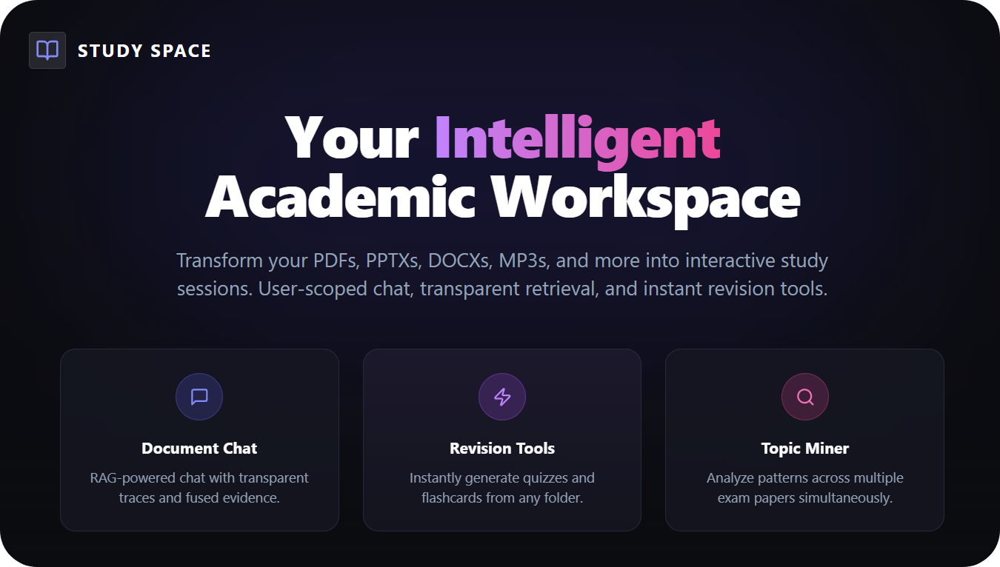
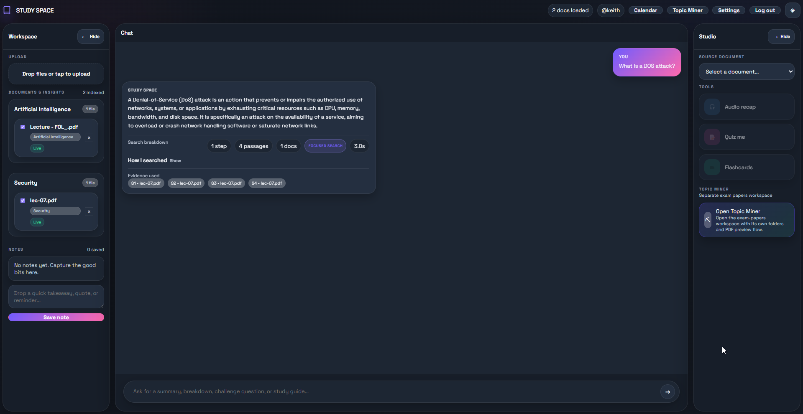

# Study Space

<p align="center">
  
</p>

<p align="center">
  <a href="https://www.python.org/"></a>
  <a href="https://nodejs.org/"></a>
  <a href="https://fastapi.tiangolo.com/"></a>
  <a href="https://react.dev/"></a>
  <a href="https://vitejs.dev/"></a>
  <a href="https://www.mongodb.com/"></a>
  <a href="https://www.trychroma.com/"></a>
  <a href="https://ai.google.dev/"></a>
  <a href="https://www.docker.com/"></a>
  <a href="https://pytest.org/"></a>
</p>

Study Space is a personal academic workspace for turning your own material into searchable, interactive study sessions. Upload documents, organize them into folders, chat against indexed content with a transparent retrieval trace, generate saved study sets for later review, and analyze collections of exam papers with Topic Miner.

## Overview

Study Space combines a FastAPI backend, a React frontend, MongoDB for structured state, and ChromaDB for semantic retrieval. The result is a user-scoped workspace where uploaded documents and saved practice material stay tied to the authenticated user, AI responses cite their evidence, and revision tools sit next to the source material instead of in a separate app.

### What it does well

- **Upload and organize** PDFs, DOCX, PPTX, XLSX, Markdown, HTML, images, audio, and more
- **Chat with transparent RAG** using visible queries, retrieval runs, fused evidence, and cited sources
- **Generate and revisit study sets** including flashcards, MCQ quizzes, written self-checks, and mixed practice
- **Mine exam folders** for recurring topics, patterns, and example questions
- **Track academic context** with extracted metadata, tags, notes, and calendar-friendly event views
- **Stay accessible** with voice input, high contrast mode, larger text, reduced motion, and stronger focus states

## Workspace Preview



## Agentic RAG, Without the Black Box

Study Space uses a **retrieval-planned RAG pipeline** rather than a single vector search or a fully autonomous agent loop.

1. The user sends a question to `POST /chat`.
2. The backend builds a compact catalog of the user's visible files and tags.
3. Gemini (`gemini-3.1-flash-lite-preview`) plans up to three retrieval steps.
4. Retrieval runs execute in ChromaDB using broad, focused, or full-document strategies.
5. Results are fused with reciprocal-rank fusion and deduplicated.
6. Gemini answers from the fused evidence set and returns a `trace` payload with sources.
7. The frontend renders the reasoning trail inline so the user can inspect how the answer was built.

That gives the app an **agentic-style planning step** while keeping execution constrained, inspectable, and grounded in the user's own material.

## Feature Highlights

### Document Workspace

- Drag-and-drop uploads with background processing and job progress
- Folder organization and editable tags
- Inline access to owned study documents and exam papers
- Personal notes linked to the workspace

### Transparent Study Chat

- Multi-query retrieval over user-scoped content
- Visible retrieval trace with generated queries and fused results
- Source-aware answers backed by chunk evidence and optional full-document fallback
- Search scope that stays limited to the authenticated user's data

### Revision Tools

- Auto-saved study sets from selected documents
- Flashcards, MCQ quizzes, written self-checks, and mixed practice modes
- Saved set library for reopening or deleting generated practice material
- Local-only written answer drafts for self-checking without storing attempts
- Metadata extraction for deadlines, events, and academic context

### Topic Miner

- Separate workflow for exam-paper folders
- Batch analysis across multiple PDFs
- Theme extraction, recurring topics, and synthesized study guidance

### Accessibility

- Voice input support
- Higher contrast mode
- Larger text
- Reduced motion
- Stronger focus states and better keyboard support

## Architecture

| Layer | Implementation |
| --- | --- |
| **Frontend** | React 18 + Vite, built into backend-served static assets |
| **Backend** | FastAPI application in `app/main.py` |
| **Structured data** | MongoDB via `app/db/mongo.py` |
| **Vector retrieval** | ChromaDB via `app/db/vector_store.py` |
| **Embeddings** | `all-MiniLM-L6-v2` via `sentence-transformers` |
| **Primary LLM** | Google Gemini via `google-genai` |
| **Document ingestion** | `app/core/ingestion.py` with Docling-based processing |
| **Topic analysis** | `app/core/topic_miner.py` |

### Model stack

- **Gemini `gemini-3.1-flash-lite-preview`** powers chat, saved study set generation, metadata extraction, and Topic Miner flows.
- **`facebook/bart-large-mnli`** is used for document classification.
- **`all-MiniLM-L6-v2`** produces embeddings for semantic retrieval in ChromaDB.

### User isolation

- MongoDB records are scoped by authenticated user identity.
- Saved study sets are stored as user-owned MongoDB records and included in account export/deletion flows.
- Study documents live under `app/users/<username>/uploads/`.
- Processed markdown lives under `app/users/<username>/processed/`.
- Exam papers live under `app/users/<username>/exam_papers/`.
- ChromaDB is shared physically, but every indexed chunk stores `owner_username`.

## Quick Start

### Prerequisites

| Requirement | Notes |
| --- | --- |
| **Python 3.12** | Matches the runtime image in `Dockerfile` |
| **Node.js 20+** | Used for the Vite frontend build |
| **MongoDB** | Local instance or remote connection string |
| **`GEMINI_API_KEY`** | Required for chat and generation features |
| **FFmpeg** | Needed for local audio-file processing; already included in Docker |

### Local setup

```bash
python3 -m venv .venv
source .venv/bin/activate
pip install -r requirements.txt

cd frontend
npm install
npm run build
cd ..
```

Set the required environment variables in your shell or in an untracked local `.env` file:

```bash
export GEMINI_API_KEY="your_key_here"
export MONGODB_URI="mongodb://localhost:27017"
export MONGODB_DB_NAME="studyspace"
```

Optional settings:

```bash
export SESSION_TTL_DAYS=7
export SESSION_COOKIE_SECURE=false
export MONGODB_APP_NAME=studyspace-api
export MONGODB_SERVER_SELECTION_TIMEOUT_MS=5000
```

Run the app:

```bash
uvicorn app.main:app --reload
```

Then open `http://127.0.0.1:8000`, create an account, and start uploading study material.

## Docker

The repository includes a multi-stage Docker build and a Docker Compose stack for local deployment.

### Start with Compose

```bash
cp .env.docker.example .env
```

Set `GEMINI_API_KEY` in `.env`, then run:

```bash
docker compose up --build
```

That starts:

- `app` on `http://127.0.0.1:8000`
- `mongo` as the internal database service

Persistent data is stored in named volumes for:

- MongoDB data
- Chroma embeddings
- User uploads and processed files

The default image is CPU-only. It installs CPU PyTorch wheels and excludes the optional Docling ASR extras, so regular local runs do not pull CUDA or NVIDIA packages.

### Optional GPU profile

```bash
docker compose --profile gpu up --build app-gpu mongo
```

Use this only if your host has NVIDIA Container Toolkit configured. The GPU profile builds a separate image that includes the optional GPU/ASR dependency set.

### Stop or reset

```bash
docker compose down
docker compose down -v
```

## Testing

Run the main test suite:

```bash
./.venv/bin/python -m pytest tests
```

Run coverage:

```bash
./.venv/bin/python -m coverage run --source=app -m pytest tests
./.venv/bin/python -m coverage report -m
```

MongoDB integration tests require `MONGODB_TEST_URI`:

```bash
MONGODB_TEST_URI="mongodb://localhost:27017" ./.venv/bin/python -m pytest tests/test_mongo_db.py
```

Run the frontend Playwright E2E suite:

```bash
cd frontend
npm run test:e2e
```

The Playwright suite starts a local Vite server and exercises mocked browser flows under `frontend/e2e/`, so it does not require the full backend stack for the covered UI journeys.

Available E2E scripts:

```bash
cd frontend
npm run test:e2e
npm run test:e2e:headed
```

For a fuller breakdown of the test suite, see [README_TESTS.md](README_TESTS.md).

## Topic Miner Workflow

Topic Miner is a separate exam-analysis workspace. Its flow is:

1. Create an exam folder.
2. Upload exam PDFs into that folder.
3. Run folder-level analysis.
4. Extract topic structure from each paper.
5. Synthesize recurring themes and example questions across the folder.
6. Reopen saved analyses later; they are marked stale when folder contents change.

## Project Layout

```text
app/
  main.py                 FastAPI entry point and API routes
  auth.py                 Session auth and password hashing
  core/
    ingestion.py          Document processing and extraction
    rag.py                Retrieval-planned RAG orchestration
    study_set_generator.py Saved flashcard, MCQ, written, and mixed practice generation
    topic_miner.py        Exam-paper analysis
  db/
    mongo.py              MongoDB integration
    vector_store.py       ChromaDB indexing and search
frontend/
  src/                    React application
assets/
  studyspace_banner.png   README hero banner
report/
  studyspace.png          Workspace preview and supporting diagrams
tests/                    Backend test suite
```

## API Overview

### Auth

- `POST /auth/signup`
- `POST /auth/signin`
- `POST /auth/logout`
- `GET /auth/me`

### Study workspace

- `POST /upload`
- `GET /upload-jobs`
- `POST /chat`
- `GET /documents`
- `GET /folders`
- `GET /tags`
- `GET /notes`
- `POST /study-sets/generate`
- `GET /study-sets`
- `GET /study-sets/{study_set_id}`
- `DELETE /study-sets/{study_set_id}`
- `POST /quiz/generate`
- `POST /flashcards/generate`
- `GET /metadata`

The `/study-sets/*` endpoints are the current frontend path for generated revision material. The older `/quiz/generate` and `/flashcards/generate` endpoints remain available for compatibility.

### Topic Miner

- `GET /exam-folders`
- `POST /exam-folders`
- `POST /exam-folders/{folder_id}/analyze`
- `GET /exam-folders/{folder_id}/analysis`
- `GET /exam-papers`
- `POST /exam-papers/upload`

## Legacy Migration

Legacy `db.json` is not used at runtime, but you can still import old data into MongoDB:

```bash
python scripts/migrate_json_to_mongo.py \
  --json-path db.json \
  --mongo-uri "$MONGODB_URI" \
  --db-name "$MONGODB_DB_NAME"
```

Preview counts without writing:

```bash
python scripts/migrate_json_to_mongo.py \
  --json-path db.json \
  --mongo-uri "$MONGODB_URI" \
  --db-name "$MONGODB_DB_NAME" \
  --dry-run
```
